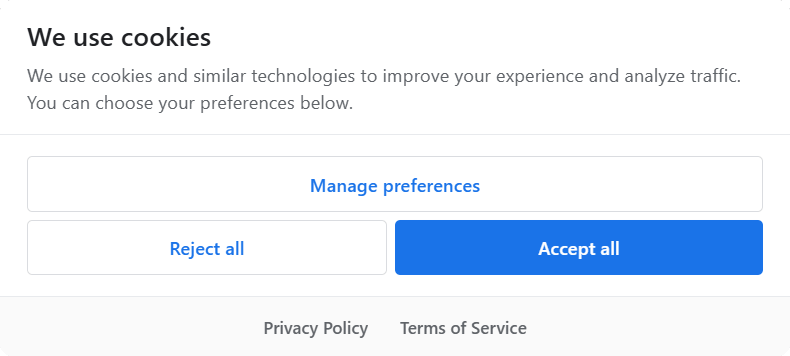

# WireBoard Laravel CMP

A consent management platform for Laravel with support for [WireBoard Analytics](https://wireboard.io), Google Analytics 4, and Google Funding Choices.



> **Disclaimer:** This package provides tools to help manage user consent. It is your responsibility to ensure your implementation meets applicable privacy regulations (GDPR, ePrivacy, etc.) for your jurisdiction. Consult with a legal professional for compliance advice.

## Features

- **Consent Mode v2** - All storage types denied by default until user consent
- **Flexible CMP Options** - Google Funding Choices (for AdSense sites) or vanilla-cookieconsent (custom CMP)
- **Google Analytics 4** - Consent-gated loading (only loads after user consent)
- **[WireBoard Analytics](https://wireboard.io)** - Configurable loading mode (cookieless first or consent required)
- **Third-Party Scripts** - Load any analytics/marketing scripts after consent with `<x-cmp::on-consent>`
- **Fully Configurable** - Theme colors, button layouts, cookie categories, languages
- **Reject All Button** - Optional "Reject all" button for quick opt-out
- **Floating Settings Button** - Cookie icon button to reopen preferences after consent
- **13 Languages** - English, French, German, Spanish, Italian, Dutch, Portuguese, Polish, Danish, Swedish, Norwegian, Finnish, Hungarian
- **Publishable Assets** - Customize CSS, JS, translations, and views

## Requirements

- PHP 8.1+
- Laravel 10.x, 11.x, or 12.x

## Installation

```bash
composer require wireboard/laravel-cmp
```

The package auto-registers via Laravel's package discovery.

### Publish Assets

```bash
# Publish everything (recommended for first install)
php artisan vendor:publish --tag=cmp

# Or publish individually:
php artisan vendor:publish --tag=cmp-config       # Config file
php artisan vendor:publish --tag=cmp-assets       # JS/CSS files
php artisan vendor:publish --tag=cmp-translations # Translation files
php artisan vendor:publish --tag=cmp-views        # Blade views
php artisan vendor:publish --tag=cmp-source       # Source files (for custom builds)
php artisan vendor:publish --tag=cmp-react        # React components (Inertia.js)
php artisan vendor:publish --tag=cmp-vue          # Vue components (Inertia.js)
```

## Configuration

Add these environment variables to your `.env` file:

```env
# Enable/Disable CMP (default: true)
CMP_ENABLED=true

# Google AdSense (determines which CMP to use)
CMP_ADSENSE_ENABLED=false
CMP_ADSENSE_PUB_ID=pub-XXXXXXXXXX

# Google Analytics 4 (requires user consent)
CMP_GA4_ENABLED=true
CMP_GA4_ID=G-XXXXXXXXXX

# WireBoard Analytics
CMP_WIREBOARD_ENABLED=false
CMP_WIREBOARD_LOADING_MODE=cookieless_first  # 'cookieless_first' or 'consent_required'
CMP_WIREBOARD_PIPELINE=pipeline-0.collector.wireboard.io
CMP_WIREBOARD_APP_ID=your-app-id
CMP_WIREBOARD_PUBLISHER=your-publisher-id
```

## Usage

### Quick Start (All-in-One)

Add a single component in your layout's `<head>`:

```blade
<head>
    <x-cmp::scripts />

    <!-- Rest of your head content -->
</head>
```

### Individual Components

For more control, use individual components:

```blade
<head>
    {{-- 1. Consent Mode v2 Defaults - MUST be first --}}
    <x-cmp::consent-mode />

    {{-- 2. CMP Script (Google Funding Choices or vanilla-cookieconsent) --}}
    <x-cmp::cmp-script />

    {{-- 3. Consent State Tracker --}}
    <x-cmp::consent-tracker />

    {{-- 4. Google Analytics 4 (consent-gated) --}}
    <x-cmp::google-analytics />

    {{-- 5. WireBoard Analytics --}}
    <x-cmp::wireboard />

    <!-- Rest of your head content -->
</head>
```

### Cookie Preferences Link (Custom CMP Only)

Add a link to let users manage their cookie preferences.

#### Blade

```blade
<footer>
    <x-cmp::cookie-preferences-link />

    {{-- Or with custom text and class --}}
    <x-cmp::cookie-preferences-link
        text="Cookie Settings"
        class="text-sm text-gray-500 hover:underline"
    />
</footer>
```

#### React / Inertia.js

Publish the React component:

```bash
php artisan vendor:publish --tag=cmp-react
```

Then use it in your components:

```tsx
import { CookiePreferencesLink, useCookieConsent } from '@/components/CookiePreferencesLink';

// As a component
<CookiePreferencesLink text="Cookie Settings" className="text-gray-600" />

// Or use the hook
const { showPreferences, hasValidConsent } = useCookieConsent();
<button onClick={showPreferences}>Cookie Settings</button>
```

#### Vue / Inertia.js

Publish the Vue component:

```bash
php artisan vendor:publish --tag=cmp-vue
```

Then use it in your components:

```vue
<script setup>
import CookiePreferencesLink from '@/components/CookiePreferencesLink.vue';
// Or use the composable
import { useCookieConsent } from '@/composables/useCookieConsent';

const { showPreferences } = useCookieConsent();
</script>

<template>
    <CookiePreferencesLink text="Cookie Settings" class="text-gray-600" />
    <!-- Or with composable -->
    <button @click="showPreferences">Cookie Settings</button>
</template>
```

> **Note:** These components only work with the Custom CMP. For Google Funding Choices, users manage preferences through Google's built-in UI.

### Third-Party Scripts (On-Consent)

Load any third-party scripts only after the user grants consent. You can use either the Blade component or JavaScript approach.

#### Option 1: Blade Component

```blade
{{-- Load analytics script after consent --}}
<x-cmp::on-consent category="analytics">
    <script src="https://static.getclicky.com/js"></script>
    <script>try{ clicky.init(123456); }catch(e){}</script>
</x-cmp::on-consent>

{{-- Load marketing/ads script after consent --}}
<x-cmp::on-consent category="marketing">
    <script src="https://example.com/pixel.js"></script>
</x-cmp::on-consent>
```

**Built-in category mappings:**
- `analytics` - Maps to `analytics_storage` consent
- `marketing` (or `ads`) - Maps to `ad_storage` consent

You can use any category name you define in your `config/cmp.php`. See [Adding a Marketing Category](#adding-a-marketing-category) for a complete example.

#### Option 2: JavaScript Event Listener

```javascript
window.addEventListener('consent.update', function(e) {
    if (e.detail.analytics_storage === 'granted') {
        // Load Clicky, Matomo, Plausible, etc.
    }
    if (e.detail.ad_storage === 'granted') {
        // Load marketing/ads scripts
    }
});
```

Both approaches work with external scripts, inline scripts, and any HTML content.

## Configuration Options

After publishing the config, edit `config/cmp.php`:

### Enable/Disable CMP

```php
'enabled' => env('CMP_ENABLED', true),
```

### AdSense / CMP Mode Selection

This setting determines which CMP is used:

```php
'adsense' => [
    'enabled' => env('CMP_ADSENSE_ENABLED', false),  // true = Google Funding Choices, false = Custom CMP
    'pub_id' => env('CMP_ADSENSE_PUB_ID'),           // Your AdSense publisher ID (pub-XXXXXXXXXX)
],
```

### WireBoard Loading Mode

Choose how WireBoard loads relative to user consent:

```php
'wireboard' => [
    'enabled' => true,
    'loading_mode' => 'cookieless_first', // or 'consent_required'
    // ...
],
```

**Available modes:**

| Mode | Behavior |
|------|----------|
| `cookieless_first` | Load immediately in cookieless mode (no cookies/localStorage). Upgrade to full tracking after consent. Best for maximum data collection while respecting privacy. |
| `consent_required` | Only load after user grants analytics consent (like GA4). No tracking at all until consent. Best for strict privacy compliance. |

```env
# Set via environment variable
CMP_WIREBOARD_LOADING_MODE=cookieless_first
```

---

## Custom CMP Options

The following options only apply when using the **Custom CMP** (AdSense disabled):

### Theme Customization

```php
'theme' => [
    'primary_bg' => '#1a73e8',        // Primary button background
    'primary_hover_bg' => '#1557b0',  // Primary button hover
    'primary_color' => '#ffffff',     // Primary button text
    'secondary_bg' => 'transparent',  // Secondary button background
    'secondary_border' => '#dadce0',  // Secondary button border
    'secondary_color' => '#1a73e8',   // Secondary button text
    'secondary_hover_bg' => '#f8f9fa',// Secondary button hover
    'modal_bg' => '#ffffff',          // Modal background
    'text_color' => '#202124',        // Main text color
    'border_radius' => '8px',         // Modal border radius
],
```

### GUI Options

```php
'custom_cmp' => [
    'gui_options' => [
        'consent_modal' => [
            'layout' => 'box inline',       // 'box', 'box inline', 'cloud', 'bar'
            'position' => 'middle center',  // Position on screen
            'equal_weight_buttons' => true, // Equal width buttons
            'flip_buttons' => true,         // [Manage] [Accept] order
        ],
        'preferences_modal' => [
            'layout' => 'box',
            'position' => 'middle center',
            'equal_weight_buttons' => true,
            'flip_buttons' => true,
        ],
    ],
],
```

### Reject All Button

Show or hide the "Reject all" button on both modals:

```php
'custom_cmp' => [
    'show_reject_button' => true,  // Set to false to hide
],
```

### Floating Settings Button

After the user makes their consent choice, a floating cookie icon appears allowing them to reopen their preferences:

```php
'custom_cmp' => [
    'show_settings_button' => true,       // Show/hide the floating button
    'settings_button_position' => 'bottom_left', // 'bottom_left' or 'bottom_right'
],
```

### Legal Links

Add privacy policy and terms of service links to the consent modal footer:

```php
'custom_cmp' => [
    'privacy_policy_url' => '/privacy-policy',
    'terms_url' => '/terms-of-service',
],
```

Links are automatically translated to the user's language.

### Cookie Categories

The package comes with two default categories: `necessary` and `analytics`. You can customize these and add new ones.

```php
'custom_cmp' => [
    'categories' => [
        'necessary' => [
            'enabled' => true,
            'read_only' => true,  // Cannot be disabled by user
        ],
        'analytics' => [
            'enabled' => true,    // Pre-toggled ON
            'read_only' => false,
            'auto_clear' => [     // Cookies to clear when disabled
                '/^_ga/',
                '_gid',
            ],
        ],
    ],
],
```

### Adding a Marketing Category

To add a "Marketing" category for ads, pixels, and tracking scripts:

**Step 1: Add the category in `config/cmp.php`:**

```php
'categories' => [
    'necessary' => [
        'enabled' => true,
        'read_only' => true,
    ],
    'analytics' => [
        'enabled' => true,
        'read_only' => false,
        'auto_clear' => ['/^_ga/', '_gid'],
    ],
    // Add marketing category
    'marketing' => [
        'enabled' => false,           // Pre-toggled OFF (user must opt-in)
        'read_only' => false,
        'auto_clear' => ['/^_fbp/', '/^_gcl/', '/^_fbc/'],  // Facebook, Google Ads cookies
    ],
],
```

**Step 2: Add translations for the new category.**

Publish translations if you haven't already:
```bash
php artisan vendor:publish --tag=cmp-translations
```

Edit `public/vendor/cmp/translations/en.json` and add a section for marketing:

```json
{
    "consentModal": {
        "title": "We use cookies",
        "description": "We use cookies and similar technologies to improve your experience and analyze traffic.",
        "acceptAllBtn": "Accept all",
        "acceptNecessaryBtn": "Reject all",
        "showPreferencesBtn": "Manage preferences"
    },
    "preferencesModal": {
        "title": "Cookie preferences",
        "acceptAllBtn": "Accept all",
        "acceptNecessaryBtn": "Reject all",
        "savePreferencesBtn": "Save preferences",
        "closeIconLabel": "Close",
        "sections": [
            {
                "title": "Necessary cookies",
                "description": "These cookies are essential for the website to function properly.",
                "linkedCategory": "necessary"
            },
            {
                "title": "Analytics cookies",
                "description": "These cookies help us understand how visitors interact with our website.",
                "linkedCategory": "analytics"
            },
            {
                "title": "Marketing cookies",
                "description": "These cookies are used to deliver personalized ads and track ad performance across websites.",
                "linkedCategory": "marketing"
            }
        ]
    }
}
```

> **Note:** Repeat this for each language file (fr.json, de.json, etc.) you want to support.

**Step 3: Load marketing scripts only after consent:**

```blade
<x-cmp::on-consent category="marketing">
    <!-- Facebook Pixel -->
    <script>
        !function(f,b,e,v,n,t,s)
        {if(f.fbq)return;n=f.fbq=function(){n.callMethod?
        n.callMethod.apply(n,arguments):n.queue.push(arguments)};
        if(!f._fbq)f._fbq=n;n.push=n;n.loaded=!0;n.version='2.0';
        n.queue=[];t=b.createElement(e);t.async=!0;
        t.src=v;s=b.getElementsByTagName(e)[0];
        s.parentNode.insertBefore(t,s)}(window, document,'script',
        'https://connect.facebook.net/en_US/fbevents.js');
        fbq('init', 'YOUR_PIXEL_ID');
        fbq('track', 'PageView');
    </script>
</x-cmp::on-consent>
```

The `marketing` category automatically maps to `ad_storage` in Google Consent Mode v2.

### Adding Languages

1. Publish translations: `php artisan vendor:publish --tag=cmp-translations`
2. Create a new JSON file in `public/vendor/cmp/translations/` (e.g., `ja.json`)
3. Add the language code to `supported_languages` in config:

```php
'supported_languages' => ['en', 'fr', 'de', 'ja'], // Added Japanese
```

## How It Works

This package supports **two CMP modes** that are automatically selected based on your configuration:

### Mode 1: Google Funding Choices (AdSense Sites)

When `CMP_ADSENSE_ENABLED=true`, the package uses **Google Funding Choices** as the CMP.

```env
CMP_ADSENSE_ENABLED=true
CMP_ADSENSE_PUB_ID=pub-XXXXXXXXXX
```

**How it works:**
- Loads Google's official CMP script from `fundingchoicesmessages.google.com`
- Fully managed by Google - design and behavior configured in your [Google AdSense Funding Choices settings](https://fundingchoices.google.com/)
- Required for sites running Google AdSense ads
- Supports TCF 2.0 / IAB framework
- Consent choices sync across Google's ad network

**Best for:** Sites monetized with Google AdSense that need Google's certified CMP.

### Mode 2: Custom CMP (vanilla-cookieconsent)

When `CMP_ADSENSE_ENABLED=false` (default), the package uses **vanilla-cookieconsent** as a fully customizable CMP.

```env
CMP_ADSENSE_ENABLED=false
```

**How it works:**
- Uses the open-source [vanilla-cookieconsent](https://github.com/orestbida/cookieconsent) library
- Fully customizable design via `config/cmp.php` and publishable assets
- Google-like appearance out of the box
- 13 languages included
- Features: Reject All button, floating settings button, legal links, custom categories

**Best for:** Sites without AdSense that want full control over their consent UI.

### Feature Comparison

| Feature | Google Funding Choices | Custom CMP |
|---------|----------------------|------------|
| Configuration | Google AdSense dashboard | `config/cmp.php` |
| Customizable design | Limited | Full control |
| Languages | Google managed | 13 included + custom |
| Reject All button | Google managed | Configurable |
| Floating settings button | No | Yes |
| Legal links (Privacy/Terms) | No | Yes |
| AdSense compatible | Required | Not needed |
| TCF 2.0 | Yes | No (Consent Mode v2) |

### Consent Flow

```
+------------------------------------------------------------------+
|                           PAGE LOAD                               |
+------------------------------------------------------------------+
                               |
                               v
+------------------------------------------------------------------+
|  1. CONSENT MODE DEFAULTS                                         |
|     gtag('consent', 'default', { analytics_storage: 'denied' })   |
+------------------------------------------------------------------+
                               |
                               v
                 +-----------------------------+
                 |   CMP_ADSENSE_ENABLED ?     |
                 +-----------------------------+
                        |             |
                   YES  |             |  NO
                        v             v
          +------------------+  +------------------+
          | Google Funding   |  | Custom CMP       |
          | Choices loads    |  | (cookieconsent)  |
          +------------------+  +------------------+
                        |             |
                        +------+------+
                               |
                               v
+------------------------------------------------------------------+
|  2. CONSENT MODAL SHOWN (first visit)                             |
|     User sees: [Reject All] [Manage Preferences] [Accept All]     |
+------------------------------------------------------------------+
                               |
                               v
+------------------------------------------------------------------+
|  3. USER MAKES CHOICE                                             |
+------------------------------------------------------------------+
                               |
                               v
+------------------------------------------------------------------+
|  4. CONSENT UPDATE                                                |
|     - gtag('consent', 'update', {...})                            |
|     - window.dispatchEvent('consent.update')                      |
+------------------------------------------------------------------+
                               |
                               v
                 +-----------------------------+
                 | analytics_storage granted?  |
                 +-----------------------------+
                        |             |
                   YES  |             |  NO
                        v             v
          +------------------+  +------------------+
          | 5a. GA4 LOADS    |  | 5b. GA4 blocked  |
          | Full tracking    |  | No tracking      |
          +------------------+  +------------------+
                               |
                               v
+------------------------------------------------------------------+
|  6. WIREBOARD (if enabled)                                        |
|     Runs in cookieless mode, can upgrade if consent granted       |
+------------------------------------------------------------------+
```

### About GA4 and Consent

This package loads GA4 only after explicit user consent because:
- GA4 sets cookies and transfers data to Google's servers
- Some EU Data Protection Authorities have raised concerns about Google Analytics
- Loading GA4 after consent provides a safer approach

### About WireBoard Analytics

[WireBoard](https://wireboard.io) is a privacy-focused analytics platform designed for modern web applications. Unlike traditional analytics tools, WireBoard offers:

- **Cookieless mode** - Can run without cookies or local storage for basic analytics
- **Privacy-first architecture** - Designed with privacy regulations in mind
- **Real-time analytics** - See your data as it happens
- **Lightweight** - Minimal impact on page performance

This package supports two loading modes for WireBoard:

**`cookieless_first` (default):**
- Loads immediately in cookieless mode (`useCookies: false`, `useLocalStorage: false`)
- Upgrades to full tracking after user grants consent
- Best for maximum data collection while respecting privacy

**`consent_required`:**
- Only loads after user grants analytics consent
- Full tracking enabled from the start (with consent)
- Best for strict privacy compliance (like GA4)

Learn more at [wireboard.io](https://wireboard.io).

> **Note:** Whether any analytics tool requires consent depends on your specific use case, jurisdiction, and legal interpretation. Consult with a legal professional.

## JavaScript Events

Listen for consent changes in your JavaScript:

```javascript
window.addEventListener('consent.update', function(e) {
    console.log('Consent state:', e.detail);
    // e.detail = {
    //   ad_storage: 'denied',
    //   analytics_storage: 'granted',
    //   ad_user_data: 'denied',
    //   ad_personalization: 'denied'
    // }
});
```

## Testing

### Check Which CMP Mode is Active

```javascript
console.log('CMP type:', window.__cmpType);  // 'google' or 'custom'
```

### Testing Custom CMP (vanilla-cookieconsent)

```javascript
// Check consent state
console.log('Consent state:', window.__consentState);
console.log('GA4 loaded:', window.__ga4Loaded);

// Reset consent to see modal again
CookieConsent.reset(true);
location.reload();

// Open preferences modal
CookieConsent.showPreferences();
```

### Testing Google Funding Choices

```javascript
// Check if Google FC is loaded
console.log('Google FC:', typeof window.googlefc);

// Check consent values
if (window.googlefc && window.googlefc.getGoogleConsentModeValues) {
    console.log('Consent:', window.googlefc.getGoogleConsentModeValues());
}

// Note: Google FC consent reset must be done through browser cookie clearing
// or the Google-provided UI
```

### Verify Analytics Loading

```javascript
// Check if GA4 loaded after consent
console.log('GA4 loaded:', window.__ga4Loaded);
console.log('Has _ga cookie:', document.cookie.includes('_ga'));
```

## Building Assets (Development)

If you need to rebuild the minified assets:

```bash
cd vendor/wireboard/laravel-cmp

# Install dependencies
npm install

# Build for production (minified)
npm run build

# Build for development (not minified)
npm run dev

# Watch for changes
npm run watch
```

## Facade

You can also use the facade in your code:

```php
use Wireboard\Cmp\Facades\Cmp;

if (Cmp::isEnabled()) {
    // CMP is active
}

if (Cmp::isGa4Enabled()) {
    $measurementId = Cmp::getGa4MeasurementId();
}

$config = Cmp::getConfig();
```

## Version

v1.2.0

## Credits

This package includes the following open-source software:

- **[vanilla-cookieconsent](https://github.com/orestbida/cookieconsent)** by Orest Bida - MIT License

## License

MIT License - see [LICENSE](LICENSE) for full details including third-party licenses.

This is open-source software. You are free to use, modify, and distribute it under the terms of the MIT License.
